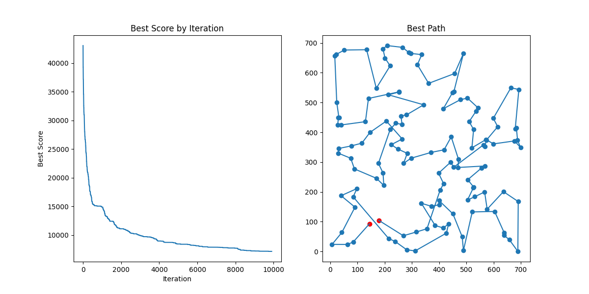
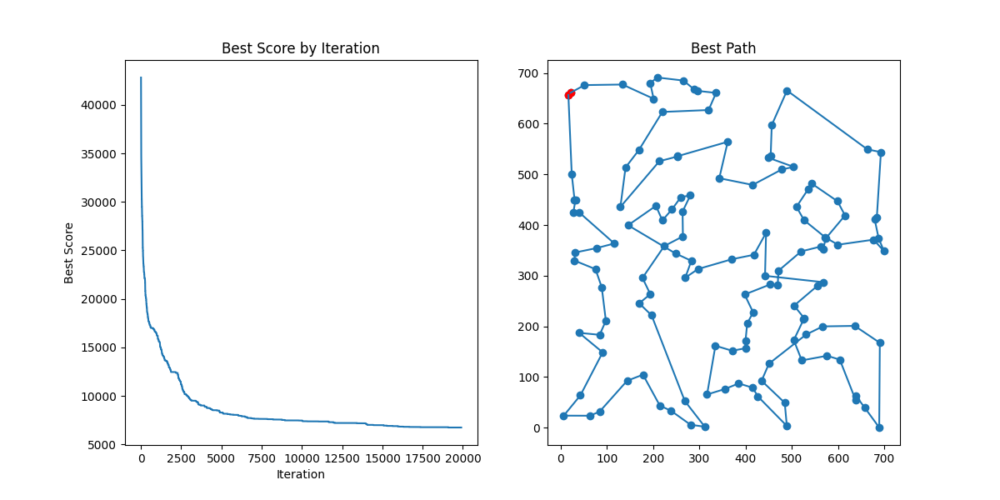

# Evolutionary Algorithm for TSP

An evolutionary algorithm implementation to solve the Traveling Salesman Problem (TSP) using genetic operators: crossover, mutation, and fitness-based selection.

## Dataset

**ch130** - 130 cities from TSPLIB95 ([source](http://comopt.ifi.uni-heidelberg.de/software/TSPLIB95/tsp/))

## Algorithm Overview

- **Population-based search**: Maintains a population of candidate solutions (city tours)
- **Fitness function**: Minimizes total tour distance
- **Crossover**: Two-point crossover preserves partial tours from parent solutions
- **Mutation**: Random rotation of tour order
- **Selection**: Fitness-proportionate selection with elitism (best solution always survives)
- **Temperature-based randomness**: Varying mutation probability over iterations for better exploration/exploitation balance

## Usage

```bash
python evoluotionaryAlgo.py
```

**Parameters** (in main):
- Population size: 100
- Iterations: 10,000 (default) or 20,000
- Mutation probability: 0.99 (99% chance no mutation occurs)

## Results

### Best Performing Variant (10,000 iterations)
Uses temperature-based randomness for dynamic mutation rates:



### Extended Run (20,000 iterations)
Further optimization with longer evolution:



The algorithm consistently converges from ~40,000 to ~7,000-8,000 distance units, showing effective optimization on the ch130 problem.

## Additional Documentation

Full implementation details and analysis available in [Report.pdf](./Report.pdf).

## License

GNU General Public License v3.0
