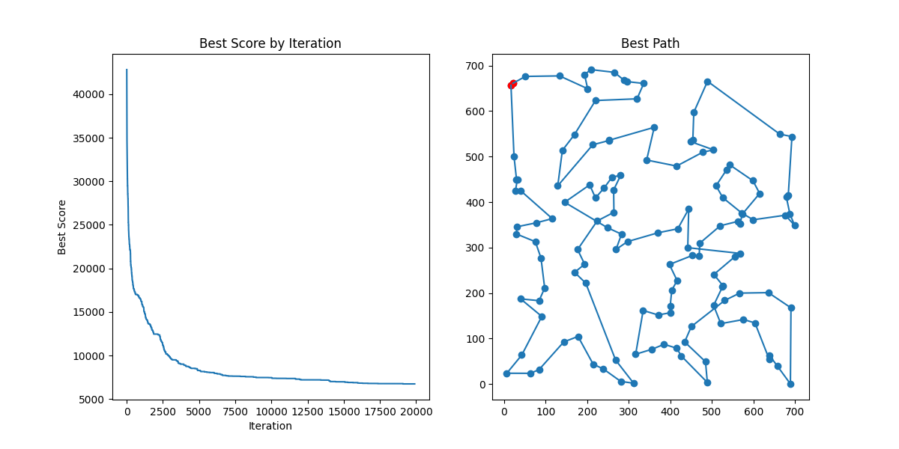

# EvolutionaryTSP

Implementation of an evolutionary algorithm for the travelling salesman problem, using the ch130 dataset: http://comopt.ifi.uni-heidelberg.de/software/TSPLIB95/tsp/. Full description available in [Report.pdf](./Report.pdf).

Results from best performing variant over 10000 iterations, using a varying temperature to represent the randomness of the variables:

Results from the best performing variant over 20000 iterations

